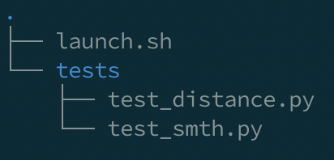

# Idea

Идея в том, чтобы приблизить опыт прохождения курсов, к опыту написания кода, который идет в продакшн. Потому что главная боль для студента, это когда он после курсов приходит на работу и выясняется, что код должен не просто правильно работать, но и соответствовать некоторым стандартам написания кода, а его этому не учили ни на онайлн курсах ни в университете. Мы считаем, что курсы по программированию необходимо приближать к реальной практике написания кода, а для этого было бы неплохо сделать аналог код ревью (хотя бы автоматический). Например, в рамках курса по C++ можно будет проверять правильно ли ученик написал билд для этого проекта, правильно ли он настроил юнит тесты (можно проверить покрытие кода тестами), правильную ли структуру проекта использует. Нужно проверять не только правильность работы программы, но и запускать статические и динамические проверки. Нужно будет проверить что код студента соответствует, например pep8 или проверить не утекает ли память в программе написанной на C. Также можно будет проверять взаимодействие программы с системой, например проверить что api, написанное студентом правильно отвечает на запросы. Конечно все эти проверки нужны не на всех курсах (например в курсе по алгоритмам не нужно проверять написаны ли юнит тесты), а для некоторых курсов нужны уникальные проверки (например проверить что студент не использует запрещенную встроенную функцию), поэтому мы также будет стараться сделать так чтобы создание курсов было как можно легче и все основные варианты использования нашей платформы уже были предусмотрены и реализованы. Но если нет, то мы предоставим простой api для написания кастомных проверок.

# Teacher scenario

# Student scenario

1. Выбрать курс
2. Выбрать как решать задачи (в рамках хака сделаем онлайн редактор кода и проверку кода из гитхаба)
3. Учиться

# Hack goal

## Frontend

1. Список курсов со старницами на которых можно смотреть видео
2. Простой редакотор кода, который сохраняет написанный код и отправляет на сервер и показывет результат
3. Страница учителя где можно загружать видео, загружать тесты, загружать скрипты для проверки статики и динамики

## Backend

1. Api для фронтенда:
   - endpoint для получения списка курсов, видео
   - ep для загрузки кода из онлайн редактора
   - ep для гитхаба (просто получить от фронта эту ссылку)
   - ep для получения результатов выполнения (сделаем прост что фронт раз в секунду просто дергает этот ep для отображения информации)
   - ep для загрузки видео, загрузки тестов и скриптов для выполнения кода
2. Взаимодействие с модулем проверок кода

## Code module

1. работа с модулями проверки кода
   - for demo we will have fixed structure and python only
      
     
      
   - we put student code in folder src and run launch.sh, capture its output and return it
2. работа с источниками кода
   - getting code from github (for students)
   - getting code in zip or tgz
   - getting single code file (for students)
