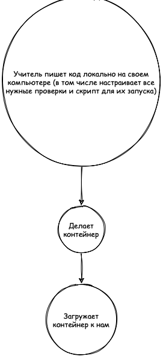
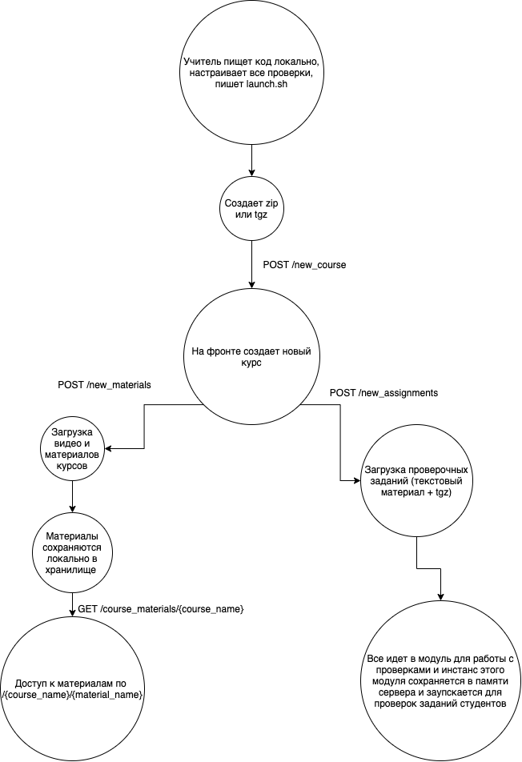
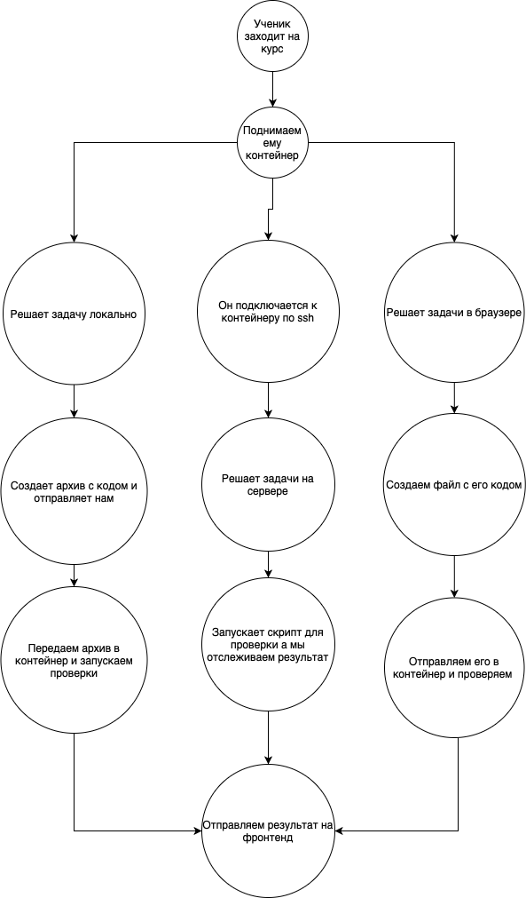
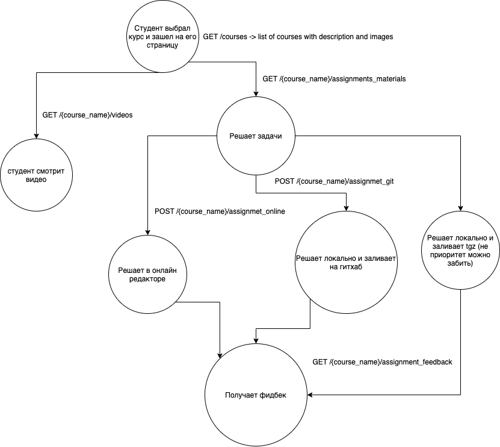

# Teacher creates new course

This we will use for tech presentation
 

This we will use for dev
 

# Student enters course

This we will use for tech presentation
 

This we will use for dev
 

